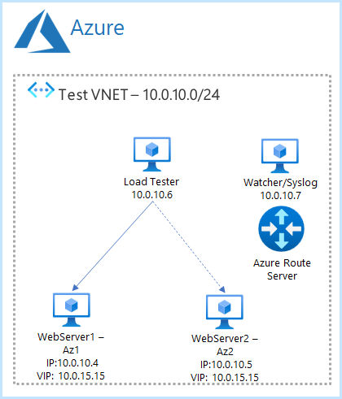

Azure Route Server Next Hop IP Fast Failover
==============
>Applies to: Azure, Linux, Route Server

- [Azure Route Server Next Hop IP Fast Failover](#azure-route-server-next-hop-ip-fast-failover)
- [1. _Architecture Overview_](#1-architecture-overview)
- [2. _Implementation_](#2-implementation)
  - [2.1 Planning](#21-planning)
  - [2.2 CLI Configuration](#22-cli-configuration)
- [3. _Build Envionrment_](#3-build-envionrment)
  - [3.1 VNET](#31-vnet)
  - [3.2 Webserver VMs](#32-webserver-vms)
  - [3.3 Load Tester VMs](#33-load-tester-vms)
  - [3.4 Watcher VMs](#34-watcher-vms)
- [4. _Connect via Bastion and Native_Client_](#4-connect-via-bastion-and-native_client)
- [5. _Manually Updates ExaBGP Routes_](#5-manually-updates-exabgp-routes)
- [_Miscellenous Helper Commands_](#miscellenous-helper-commands)
  - [Manual Log Test Command](#manual-log-test-command)
  - [Start all VMs](#start-all-vms)
  - [Stop all VMs](#stop-all-vms)
- [_References_](#references)


# 1. _Architecture Overview_

The premise of this article is to understand whether traditional low-latency applications (such as VOIP) which use a floating virtual IP (VIP) can be migrated to Azure and achieve failover times of 5 seconds or less. Azure has supported VIPs for a long time, the standard method is to use a route table entry for the VIP address with a /32 subnet, with the next-hop set to the virtual appliance or VM you want to send the traffic to; the main issue with this approach is the update time in the event of a failure as this seemed to be anywhere from 10 seconds to 60 seconds, as the request has to make its was through the Azure API - this is fine for web applications but for low-latency applications is not fast enough.

On 1st Aug, 2022 Microsoft GA'd a new feature for route server called [next-hop-ip](https://docs.microsoft.com/en-gb/azure/route-server/next-hop-ip), this allows Azure's Software Defined Network (SDN) to be manipulated directly using BGP instead of going through the API, and means any BGP routes you inject into route server are propagated to all VM NIC's immediately.

One issue I ran into was that Azure's SDN appears to have anti-flapping protection included, as routes can only be updated once every 30 seconds. Initially the BGP server I was using was [BIRD](https://bird.network.cz/) and then [Quagga](https://www.quagga.net/), the next-hop update involved changing the config and restarting the processes, this meant that routes were first of all withdrawn (which was a routing change) and then new routes added (second change) which was then taking 30 seconds to propagate. Changing over to [ExaBGP](https://github.com/Exa-Networks/exabgp) gave me full control and meant I could announce a single routing update which would be propagated immediately.


  *Figure 1: Architecture Overview.*

Testing the failover by directly issuing commands to ExaBGP on the watcher node, allowed me see failover times in the 0.9s to 5.4s range.

*N.B.*
On the watcher2 VM, I stuck with using quagga for debugging as the vtysh command has more options than the exabgpcli command.

The details of how the test environment was built including all scripts is the subject of the rest of this article.

# 2. _Implementation_
## 2.1 Planning

Before building the environment, it is important to plan out the basics which are listed in the table below:

| Variable | Purpose | Value |
| --- | --- | --- |
| REGION | The Azure Region used during testing | uksouth |
| RG | The Resource Group during testing for the network and route server | next-hop-ip-rg |
| RG_VM | The Resource Group during testing for the VMs | next-hop-ip-vm-rg |
| VNET_Name | The name of the testing VNET | next-hop-ip-vnet |
| VNET_CIDR | The CIDR of the VNET during testing | 10.10.0.0/16 |
| Default_Subnet_Name | The name of the default subnet | default |
| Default_Subnet_CIDR | The CIDR of the subnet within the VNET - we will use the whole range | 10.10.0.0/24 |
| RouteServer_Subnet_Name | The name of the routeserver subnet | RouteServerSubnet |
| RouteServer_Subnet_CIDR | The CIDR of the subnet within the VNET - we will use the whole range | 10.10.1.0/24 |
| RouteServer_Subnet_Id | The Azure Id of the route server subnet | <queried when run> |
| Bastion_Subnet_Name | The name of the bastion subnet | AzureBastionSubnet |
| Bastion_Subnet_CIDR | The CIDR of the bastion subnet | 10.10.2.0/24 |
| Bastion_PublicIP_Name | The PublicIP of the bastion subnet | bastion-public-ip |
| Bastion_Name | Resource name for bastion server | next-hop-ip-bastion |
| Route_Server_Name | The name of the route server | next-hop-ip-routeserver |
| Route_Server_PublicIP | The Public IP of the route server | routeserver-ip |
| Route_Table_Name | The name of the route table | next-hop-ip-rt |
| VIP | The virtual IP (VIP) which will be shared between the 2 webservers | 100.64.0.1/32 |
| VM_User | Username for all VM's | chris |
| SSH_KEY_PUB | The public SSH key | .ssh\id_rsa.nexthop.pub |
| SSH_KEY_PRIV | The private SSH key | .ssh\id_rsa.nexthop |
| VM_Size | Size for all VM's | Standard_B2ms |
| VM_Image | VM Image used for Operating System | ubuntu-21-04-lts | 
| WS1_Hostname | Hostname of VM Webserver 1 | ws1 |
| WS1_IP | IP of VM Webserver 1 | 10.10.0.4 |
| WS2_Hostname | Hostname of VM Webserver 2 | ws2 |
| WS2_IP | IP of VM Webserver 2 | 10.10.0.5 |
| LT1_Hostname | Hostname of LoadTest VM | lt1 |
| LT1_IP | IP of LoadTest VM | 10.10.0.6 |
| Watch1_Hostname | Hostname of Watcher VM | watch1 |
| Watch1_IP | IP of Watcher VM | 10.10.0.7 |

## 2.2 CLI Configuration

Clone the repository and login to Azure CLI - I typically do this using the powershell terminal from VS Code
```powershell-interactive
git clone https://github.com/chriselleman-msft/azure-route-server-next-hop-ip-fast-failover
cd "azure-route-server-next-hop-ip-fast-failover"
az login
```

Set powershell environment variables - based on table above

```powershell-interactive
set REGION uksouth
set RG next-hop-ip-rg
set RG_VM next-hop-ip-vm-rg
set VNET_Name next-hop-ip-vnet
set VNET_CIDR "10.10.0.0/16"
set Default_Subnet_Name default
set Default_Subnet_CIDR "10.10.0.0/24"
set RouteServer_Subnet_Name RouteServerSubnet
set RouteServer_Subnet_CIDR 10.10.1.0/24
set Route_Server_Name next-hop-ip-routeserver
set Route_Server_PublicIP routeserver-ip
set Bastion_Subnet_Name AzureBastionSubnet
set Bastion_Subnet_CIDR  10.10.2.0/24
set Bastion_PublicIP_Name bastion-public-ip
set Bastion_Name next-hop-ip-bastion
set Route_Table_Name next-hop-ip-rt
set VIP "100.64.0.1/32"
set VM_User chris
set SSH_KEY_PUB ".ssh\id_rsa.nexthop.pub"
set SSH_KEY_PRIV ".ssh\id_rsa.nexthop"
set VM_Size Standard_B2ms
set VM_Image Canonical:0001-com-ubuntu-server-focal:20_04-lts-gen2:latest
set WS1_Hostname ws1
set WS1_IP 10.10.0.4
set WS2_Hostname ws2
set WS2_IP 10.10.0.5
set LT1_Hostname lt1
set LT1_IP 10.10.0.6
set Watch1_Hostname watch1
set Watch1_IP 10.10.0.7
```

# 3. _Build Envionrment_

## 3.1 VNET
Use the following commands to build the environment:

```powershell-interactive
# Create resource group for Network and Route Server
az group create --name $RG --location $REGION

# Create resource group for VMs
az group create --name $RG_VM --location $REGION

# Create VNET with default Subnet
az network vnet create -g $RG -n $VNET_Name --address-prefix $VNET_CIDR $VIP --subnet-name $Default_Subnet_Name --subnet-prefix $Default_Subnet_CIDR --location $REGION

#Create Route Server Subnet
az network vnet subnet create -g $RG --vnet-name $VNET_Name -n $RouteServer_Subnet_Name --address-prefixes $RouteServer_Subnet_CIDR

#Create Bastion Subnet
az network vnet subnet create -g $RG --vnet-name $VNET_Name -n $Bastion_Subnet_Name --address-prefixes $Bastion_Subnet_CIDR
```
N.B. You need to enable Native Client Support via the portal in the Bastion -> Configuration Blade
```powershell-interactive
# Query Default Subnet ID
set Default_Subnet_Id (az network vnet subnet show -g $RG --vnet-name $VNET_Name --name $Default_Subnet_Name  --query "{objectID:id}" --output tsv)

# Query Route Server Subnet ID
set RouteServer_Subnet_Id (az network vnet subnet show -g $RG --vnet-name $VNET_Name --name $RouteServer_Subnet_Name  --query "{objectID:id}" --output tsv)

# Create Route Server Public IP - Note: Must be Standard SKU
az network public-ip create -g $RG -n $Route_Server_PublicIP --sku Standard

# Create Route Server - can take a few minutes
az network routeserver create --resource-group $RG --name $Route_Server_Name --hosted-subnet $RouteServer_Subnet_Id --public-ip-address $Route_Server_PublicIP --location $REGION

# Set-Up Route Server Peering
az network routeserver peering create --resource-group $RG --routeserver $Route_Server_Name --name "watcher" --peer-asn 65001 --peer-ip $Watch1_IP


# Create Bastion Server Public IP - Note: Must be Standard SKU
az network public-ip create -g $RG -n $Bastion_PublicIP_Name --sku Standard

# Create Bastion Server - can take a few minutes
az network bastion create --location $REGION --name $Bastion_Name --public-ip-address $Bastion_PublicIP_Name --resource-group $RG --vnet-name $VNET_Name

# Create Route Table
az network route-table create -g $RG -n $Route_Table_Name

# Attache Route Table to default subnet
az network vnet subnet update -g $RG -n $Default_Subnet_Name --vnet-name $VNET_Name --route-table $Route_Table_Name
```

## 3.2 Webserver VMs
Use the following commands to create the VM's:

Generate SSH key - you can leave the passphrase black for testing. The directory is created within the repo directory as subsequent commands use relative paths:
```powershell-interactive
mkdir .ssh
ssh-keygen -b 4096 -f "$SSH_KEY_PRIV"
```

```powershell-interactive
# Webserver 1
az vm create --resource-group $RG_VM --name $WS1_Hostname --image $VM_Image --custom-data assets\custom-webserver.sh --admin-username $VM_User --ssh-key-values $SSH_KEY_PUB --zone 1 --private-ip-address $WS1_IP --subnet $Default_Subnet_Id --size $VM_Size --public-ip-address '""' --nsg '""' --no-wait

# Webserver 2
az vm create --resource-group $RG_VM --name $WS2_Hostname --image $VM_Image --custom-data assets\custom-webserver.sh --admin-username $VM_User --ssh-key-values $SSH_KEY_PUB --zone 2 --private-ip-address $WS2_IP --subnet $Default_Subnet_Id --size $VM_Size --public-ip-address '""' --nsg '""' --no-wait
```

## 3.3 Load Tester VMs
Use the following commands to create the Injector VM's:

```powershell-interactive
# LT 1
az vm create --resource-group $RG_VM --name $LT1_Hostname --image $VM_Image --custom-data assets\custom-loadtester.sh --admin-username $VM_User --ssh-key-values $SSH_KEY_PUB --zone 1 --private-ip-address $LT1_IP --subnet $Default_Subnet_Id --size $VM_Size --public-ip-address '""' --nsg '""' --no-wait
```

## 3.4 Watcher VMs
Use the following commands to create the Watcher VM's:

```powershell-interactive
# Watch 1
az vm create --resource-group $RG_VM --name $Watch1_Hostname --image $VM_Image --custom-data assets\custom-watcher.sh --admin-username $VM_User --ssh-key-values $SSH_KEY_PUB --zone 1 --private-ip-address $Watch1_IP --subnet $Default_Subnet_Id --size $VM_Size --public-ip-address '""' --nsg '""' --no-wait

# Watch 2 - temporary for BGP debugging
az vm create --resource-group $RG_VM --name watch2 --image $VM_Image --custom-data assets\custom-watcher2.sh --admin-username $VM_User --ssh-key-values $SSH_KEY_PUB --zone 1 --private-ip-address 10.10.0.8 --subnet $Default_Subnet_Id --size $VM_Size --public-ip-address '""' --nsg '""' --no-wait
```

# 4. _Connect via Bastion and Native_Client_

From the powershell cli or the new Windows Terminal, do the following:

```powershell-interactive
# Find VM Id
set VM_Id (az vm list --resource-group $RG_VM --output tsv --query "[?contains(name, 'watch1')].id")
# Open SSH connection
az network bastion ssh --name $Bastion_Name --resource-group $RG --target-resource-id $VM_Id --auth-type ssh-key --username chris --ssh-key $SSH_KEY_PRIV

set VM_Id (az vm list --resource-group $RG_VM --output tsv --query "[?contains(name, 'watch2')].id")
# Open SSH connection
az network bastion ssh --name $Bastion_Name --resource-group $RG --target-resource-id $VM_Id --auth-type ssh-key --username chris --ssh-key $SSH_KEY_PRIV

# Find VM Id
set VM_Id (az vm list --resource-group $RG_VM --output tsv --query "[?contains(name, 'lt1')].id")
# Open SSH connection
az network bastion ssh --name $Bastion_Name --resource-group $RG --target-resource-id $VM_Id --auth-type ssh-key --username chris --ssh-key $SSH_KEY_PRIV

# Find VM Id
set VM_Id (az vm list --resource-group $RG_VM --output tsv --query "[?contains(name, 'ws1')].id")
# Open SSH connection
az network bastion ssh --name $Bastion_Name --resource-group $RG --target-resource-id $VM_Id --auth-type ssh-key --username chris --ssh-key $SSH_KEY_PRIV

# Find VM Id
set VM_Id (az vm list --resource-group $RG_VM --output tsv --query "[?contains(name, 'ws2')].id")
# Open SSH connection
az network bastion ssh --name $Bastion_Name --resource-group $RG --target-resource-id $VM_Id --auth-type ssh-key --username chris --ssh-key $SSH_KEY_PRIV

# Query routeserver for peering connections
az network routeserver peering list-learned-routes --name "watcher" --routeserver $Route_Server_Name --resource-group $RG
az network nic show-effective-route-table --name lt1VMNic --resource-group $RG_VM --output table
```

# 5. _Manually Updates ExaBGP Routes_
```powershell-interactive
# Updates routes
sudo bash -c 'echo "announce route 100.64.0.1/32 next-hop 10.10.0.4" >/etc/exabgp/exabgp.cmd'; date +%s.%3N
sudo bash -c 'echo "announce route 100.64.0.1/32 next-hop 10.10.0.5" >/etc/exabgp/exabgp.cmd'; date +%s.%3N
```


# _Miscellenous Helper Commands_

## Manual Log Test Command
```bash
 while [ true ]; do curl --max-time 0.2 http://100.64.0.1/ 2>&1; echo ""; sleep 0.3; done
```

## Start all VMs
```powershell-interactive
$vms = @('lt1','watch1','watch2','ws1','ws2')
Foreach ($vm in $vms) {
    Write-Host $vm;
    az vm start --no-wait --resource-group $RG_VM --name $vm
}
```

## Stop all VMs
```powershell-interactive
$vms = @('lt1','watch1','watch2','ws1','ws2')
Foreach ($vm in $vms) {
    Write-Host $vm;
    az vm stop --no-wait --resource-group $RG_VM --name $vm
}
Foreach ($vm in $vms) {
    Write-Host $vm;
    az vm deallocate --no-wait --resource-group $RG_VM --name $vm
}
```

# _References_

- https://github.com/Exa-Networks/exabgp - ExaBGP Github
- https://github.com/AndrewBryson/azure-route-server-failover - Andrew Bryson's ExaBGP Blog Post
- https://github.com/adstuart/azure-routeserver-anycast - Adam Stuart's Route Server Anycast Blog Post