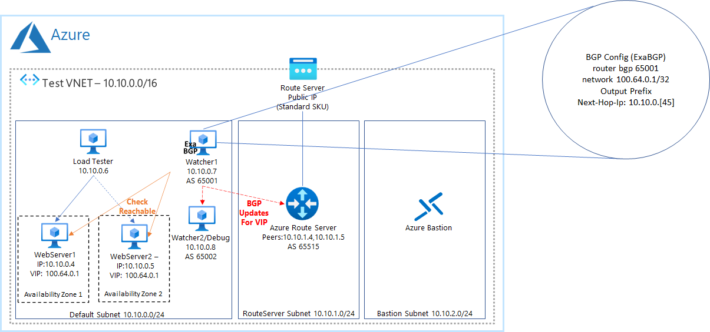

Azure Route Server Next Hop IP Fast Failover
==============

>Applies to: Azure, Linux, Route Server

# 1. _Architecture Overview_

  

  *Figure 1: Architecture Overview.*

# 2. _Implementation_
## 2.1 Planning

Before building the environment, it is important to plan out the basics which are listed in the table below:

| Variable | Purpose | Value |
| --- | --- | --- |
| REGION | The Azure Region used during testing | uksouth |
| RG | The Resource Group during testing for the network and route server | next-hop-ip-rg |
| RG_VM | The Resource Group during testing for the network and route server | next-hop-ip-vm-rg |
| VNET_Name | The name of the testing VNET | next-hop-ip-vnet |
| VNET_CIDR | The CIDR of the VNET during testing | 10.10.0.0/16 |
| Default_Subnet_Name | The name of the default subnet | default |
| Default_Subnet_CIDR | The CIDR of the subnet within the VNET - we will use the whole range | 10.10.0.0/24 |
| RouteServer_Subnet_Name | The name of the routeserver subnet | RouteServerSubnet |
| RouteServer_Subnet_CIDR | The CIDR of the subnet within the VNET - we will use the whole range | 10.10.1.0/24 |
| RouteServer_Subnet_Id | The Azure Id of the route server subnet | <queried when run> |
| Bastion_Subnet_Name | The name of the bastion subnet | AzureBastionSubnet |
| Bastion_Subnet_CIDR | The CIDR of the bastion subnet | 10.10.2.0/24 |
| Bastion_PublicIP_Name | The PublicIP of the bastion subnet | bastion-public-ip |
| Bastion_Name | Resource name for bastion server | next-hop-ip-bastion |
| Route_Server_Name | The name of the route server | next-hop-ip-routeserver |
| Route_Server_PublicIP | The Public IP of the route server | routeserver-ip |
| Route_Table_Name | The name of the route table | next-hop-ip-rt |
| VIP | The virtual IP (VIP) which will be shared between the 2 webservers | 10.10.15.15/32 |
| SSH_KEY_PUB | The public SSH key | .ssh\id_rsa.nexthop.pub |
| SSH_KEY_PRIV | The private SSH key | .ssh\id_rsa.nexthop |
| VM_User | Username for all VM's | chris |
| VM_Password | Password for all VM's | Pword9876543 |
| VM_Size | Size for all VM's | Standard_B2ms |
| WS1_Hostname | Hostname of VM Webserver 1 | ws1 |
| WS1_IP | IP of VM Webserver 1 | 10.10.0.4 |
| WS2_Hostname | Hostname of VM Webserver 2 | ws2 |
| WS2_IP | IP of VM Webserver 2 | 10.10.0.5 |
| LT1_Hostname | Hostname of LoadTest VM | lt1 |
| LT1_IP | IP of LoadTest VM | 10.10.0.6 |
| Watch1_Hostname | Hostname of Watcher VM | watch1 |
| Watch1_IP | IP of Watcher VM | 10.10.0.7 |

## 2.2 CLI Configuration

Login to Azure CLI - I typically do this using the powershell terminal from VS Code
```powershell-interactive
az login
```

Set powershell environment variables
```powershell-interactive
set REGION uksouth
set RG next-hop-ip-rg
set RG_VM next-hop-ip-vm-rg
set VNET_Name next-hop-ip-vnet
set VNET_CIDR "10.10.0.0/16"
set Default_Subnet_Name default
set Default_Subnet_CIDR "10.10.0.0/24"
set RouteServer_Subnet_Name RouteServerSubnet
set RouteServer_Subnet_CIDR 10.10.1.0/24
set Route_Server_Name next-hop-ip-routeserver
set Route_Server_PublicIP routeserver-ip
set Bastion_Subnet_Name AzureBastionSubnet
set Bastion_Subnet_CIDR  10.10.2.0/24
set Bastion_PublicIP_Name bastion-public-ip
set Bastion_Name next-hop-ip-bastion
set Route_Table_Name next-hop-ip-rt
set VIP "10.10.15.15/32"
set SSH_KEY_PUB ".ssh\id_rsa.nexthop.pub"
set SSH_KEY_PRIV ".ssh\id_rsa.nexthop"
set VM_User chris
set VM_Size Standard_B2ms
set VM_Password Pword9876543
set WS1_Hostname ws1
set WS1_IP 10.10.0.4
set WS2_Hostname ws2
set WS2_IP 10.10.0.5
set LT1_Hostname lt1
set LT1_IP 10.10.0.6
set Watch1_Hostname watch1
set Watch1_IP 10.10.0.7
```

# 3. _Build Envionrment_

## 3.1 VNET
Use the following commands to build the environment:

```powershell-interactive
# Create resource group for Network and Route Server
az group create --name $RG --location $REGION

# Create resource group for VMs
az group create --name $RG_VM --location $REGION

# Create VNET with default Subnet
az network vnet create -g $RG -n $VNET_Name --address-prefix $VNET_CIDR $VIP --subnet-name $Default_Subnet_Name --subnet-prefix $Default_Subnet_CIDR --location $REGION

#Create Route Server Subnet
az network vnet subnet create -g $RG --vnet-name $VNET_Name -n $RouteServer_Subnet_Name --address-prefixes $RouteServer_Subnet_CIDR

#Create Bastion Subnet
az network vnet subnet create -g $RG --vnet-name $VNET_Name -n $Bastion_Subnet_Name --address-prefixes $Bastion_Subnet_CIDR
# N.B. You need to enable Native Client Support via the portal in the Bastion -> Configuration Blade

# Query Default Subnet ID
set Default_Subnet_Id (az network vnet subnet show -g $RG --vnet-name $VNET_Name --name $Default_Subnet_Name  --query "{objectID:id}" --output tsv)

# Query Route Server Subnet ID
set RouteServer_Subnet_Id (az network vnet subnet show -g $RG --vnet-name $VNET_Name --name $RouteServer_Subnet_Name  --query "{objectID:id}" --output tsv)

# Create Route Server Public IP - Note: Must be Standard SKU
az network public-ip create -g $RG -n $Route_Server_PublicIP --sku Standard

# Create Route Server - can take a few minutes
az network routeserver create --resource-group $RG --name $Route_Server_Name --hosted-subnet $RouteServer_Subnet_Id --public-ip-address $Route_Server_PublicIP --location $REGION

# Set-Up Route Server Peering
az network routeserver peering create --resource-group $RG --routeserver $Route_Server_Name --name "watcher" --peer-asn 65001 --peer-ip $Watch1_IP


# Create Bastion Server Public IP - Note: Must be Standard SKU
az network public-ip create -g $RG -n $Bastion_PublicIP_Name --sku Standard

# Create Bastion Server - can take a few minutes
az network bastion create --location $REGION --name $Bastion_Name --public-ip-address $Bastion_PublicIP_Name --resource-group $RG --vnet-name $VNET_Name

# Create Route Table
az network route-table create -g $RG -n $Route_Table_Name

# Attache Route Table to default subnet
az network vnet subnet update -g $RG -n $Default_Subnet_Name --vnet-name $VNET_Name --route-table $Route_Table_Name
```

## 3.2 Webserver VMs
Use the following commands to create the VM's:

Generate SSH key - you can leave the passphrase black for testing
```powershell-interactive
ssh-keygen -b 4096 -f "$SSH_KEY_PRIV"
```

```powershell-interactive
# Webserver 1
az vm create --resource-group $RG_VM --name $WS1_Hostname --image UbuntuLTS --custom-data assets\custom-webserver.sh --admin-username $VM_User --ssh-key-values $SSH_KEY_PUB  --zone 1 --private-ip-address $WS1_IP --subnet $Default_Subnet_Id --size $VM_Size --public-ip-address '""' --nsg '""'

# Get NICname (May not be needed)
set WS1_NIC_Name (az network nic list --resource-group $RG_VM --output tsv --query "[?contains(name, 'ws1')].name")

# Enable IP Forwarding (May not be needed)
az network nic update --name $WS1_NIC_Name --resource-group $RG_VM --ip-forwarding true

# Webserver 2
az vm create --resource-group $RG_VM --name $WS2_Hostname --image UbuntuLTS --custom-data assets\custom-webserver.sh --admin-username $VM_User --admin-password $VM_Password  --zone 2 --private-ip-address $WS2_IP --subnet $Default_Subnet_Id --size $VM_Size --public-ip-address '""' --nsg '""'

# Get NICname (May not be needed)
set WS2_NIC_Name (az network nic list --resource-group $RG_VM --output tsv --query "[?contains(name, 'ws2')].name")

# Enable IP Forwarding (May not be needed)
az network nic update --name $WS2_NIC_Name --resource-group $RG_VM --ip-forwarding true
```

## 3.3 Load Tester VMs
Use the following commands to create the Injector VM's:

```powershell-interactive
# LT 1
az vm create --resource-group $RG_VM --name $LT1_Hostname --image UbuntuLTS --custom-data assets\custom-loadtester.sh --admin-username $VM_User --admin-password $VM_Password  --zone 1 --private-ip-address $LT1_IP --subnet $Default_Subnet_Id --size $VM_Size --public-ip-address '""' --nsg '""'
```

## 3.4 Watcher VMs
Use the following commands to create the Watcher VM's:

```powershell-interactive
# Watch 1
az vm create --resource-group $RG_VM --name $Watch1_Hostname --image UbuntuLTS --custom-data assets\custom-watcher.sh --admin-username $VM_User --admin-password $VM_Password  --zone 1 --private-ip-address $Watch1_IP --subnet $Default_Subnet_Id --size $VM_Size --public-ip-address '""' --nsg '""'

# Watch 2 - temporary for BGP debugging
az vm create --resource-group $RG_VM --name watch2 --image UbuntuLTS --custom-data assets\custom-watcher.sh --admin-username $VM_User --admin-password $VM_Password  --zone 1 --private-ip-address 10.10.0.8 --subnet $Default_Subnet_Id --size $VM_Size --public-ip-address '""' --nsg '""'
```

# 4. _Connect via Bastion and Native_Client_

From the powershell cli or the new Windows Terminal, do the following:

```powershell-interactive
# Login
az login

# Find VM Id
set VM_Id (az vm list --resource-group "next-hop-ip-vm-rg" --output tsv --query "[?contains(name, 'watch1')].id")
# Open SSH connection
az network bastion ssh --name "next-hop-ip-bastion" --resource-group "next-hop-ip-rg" --target-resource-id $VM_Id --auth-type password --username chris

set VM_Id (az vm list --resource-group "next-hop-ip-vm-rg" --output tsv --query "[?contains(name, 'watch2')].id")
# Open SSH connection
az network bastion ssh --name "next-hop-ip-bastion" --resource-group "next-hop-ip-rg" --target-resource-id $VM_Id --auth-type password --username chris

# Find VM Id
set VM_Id (az vm list --resource-group "next-hop-ip-vm-rg" --output tsv --query "[?contains(name, 'lt1')].id")
# Open SSH connection
az network bastion ssh --name "next-hop-ip-bastion" --resource-group "next-hop-ip-rg" --target-resource-id $VM_Id --auth-type password --username chris

# Find VM Id
set VM_Id (az vm list --resource-group "next-hop-ip-vm-rg" --output tsv --query "[?contains(name, 'ws1')].id")
# Open SSH connection
az network bastion ssh --name "next-hop-ip-bastion" --resource-group "next-hop-ip-rg" --target-resource-id $VM_Id --auth-type ssh-key --username chris --ssh-key .ssh\id_rsa.nexthop

# Find VM Id
set VM_Id (az vm list --resource-group "next-hop-ip-vm-rg" --output tsv --query "[?contains(name, 'ws2')].id")
# Open SSH connection
az network bastion ssh --name "next-hop-ip-bastion" --resource-group "next-hop-ip-rg" --target-resource-id $VM_Id --auth-type password --username chris

# Query routeserver for peering connections
az network routeserver peering list-learned-routes --name "watcher" --routeserver "next-hop-ip-routeserver" --resource-group "next-hop-ip-rg"
az network nic show-effective-route-table --name lt1VMNic --resource-group next-hop-ip-vm-rg --output table
```

# 5. _Manually Updates ExaBGP Routes_
```powershell-interactive
# Updates routes
sudo bash -c 'echo "announce route 100.64.0.1/32 next-hop 10.10.0.4" >/var/run/exabgp.cmd'; date +%s.%3N
sudo bash -c 'echo "announce route 100.64.0.1/32 next-hop 10.10.0.5" >/var/run/exabgp.cmd'; date +%s.%3N
```


# _Miscellenous Helper Commands_

## Manual Log Test Command
```bash
 while [ true ]; do curl --max-time 0.1 http://100.64.0.1/ 2>&1; echo ""; sleep 0.3; done
```

## Start all VMs
```powershell-interactive
$vms = @('lt1','watch1','watch2','ws1','ws2')
Foreach ($vm in $vms) {
    Write-Host $vm;
    az vm start --no-wait --resource-group next-hop-ip-vm-rg --name $vm
}
```

## Stop all VMs
```powershell-interactive
$vms = @('lt1','watch1','watch2','ws1','ws2')
Foreach ($vm in $vms) {
    Write-Host $vm;
    az vm stop --no-wait --resource-group next-hop-ip-vm-rg --name $vm
}
```

# _References_

https://github.com/Exa-Networks/exabgp - ExaBGP Github